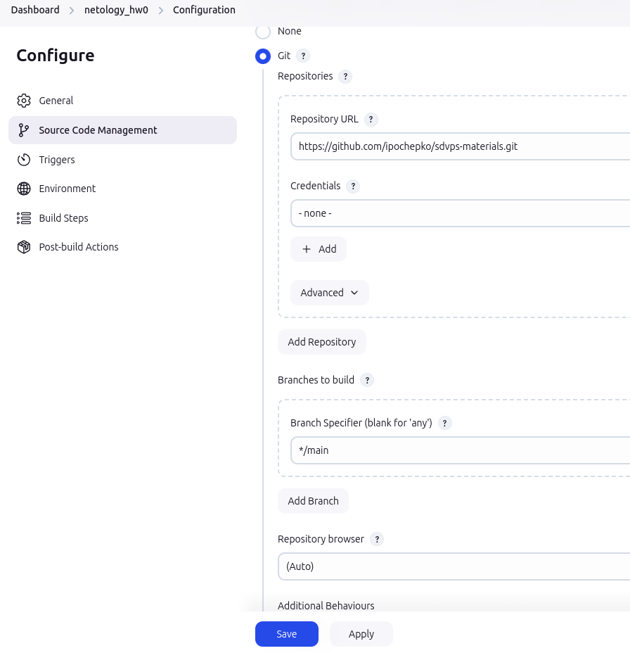
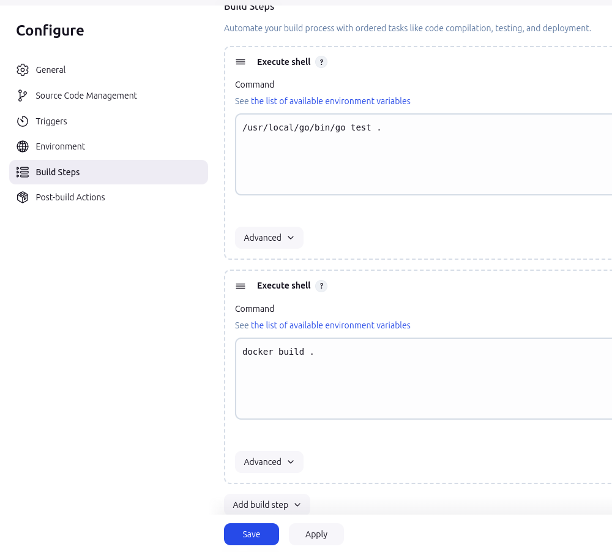
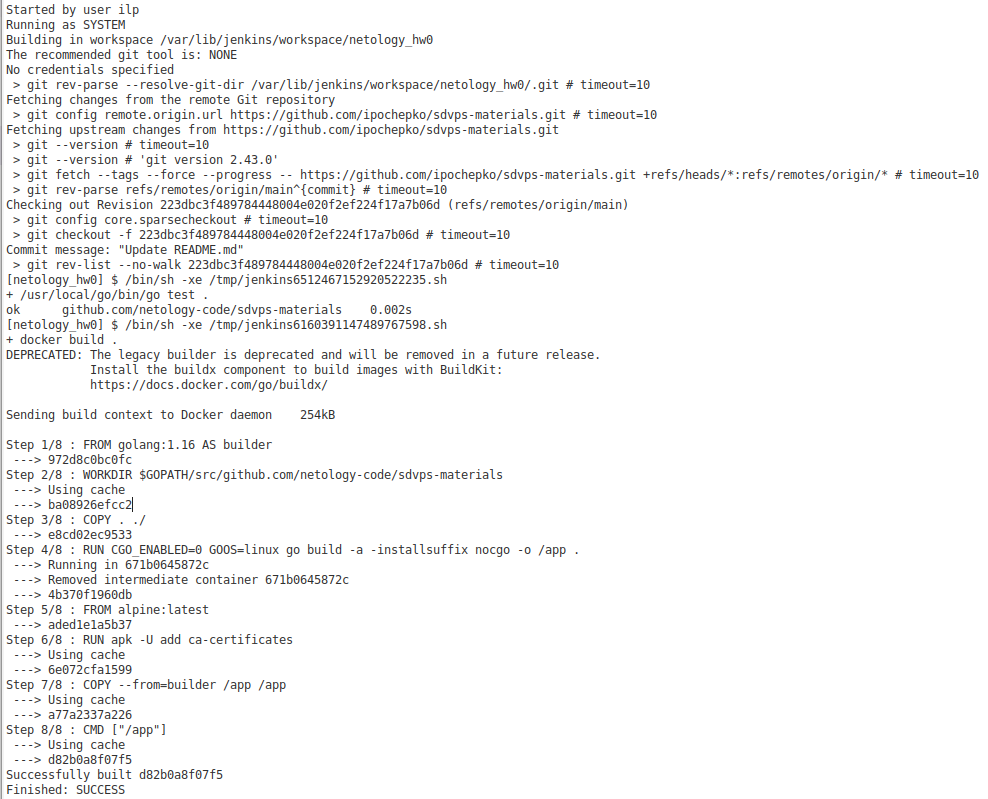
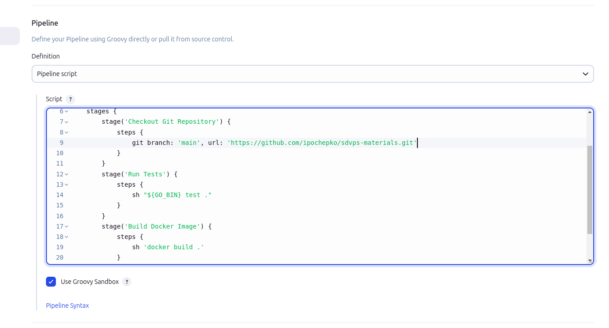
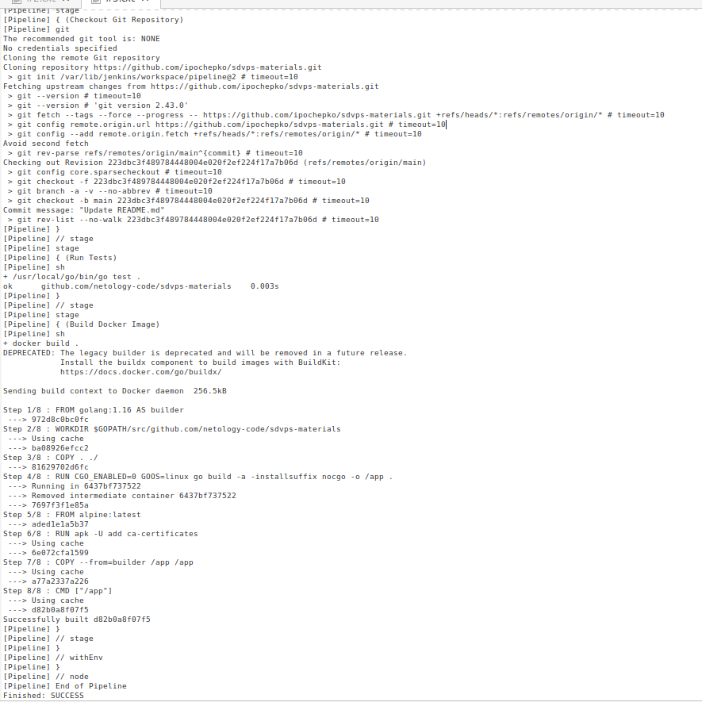
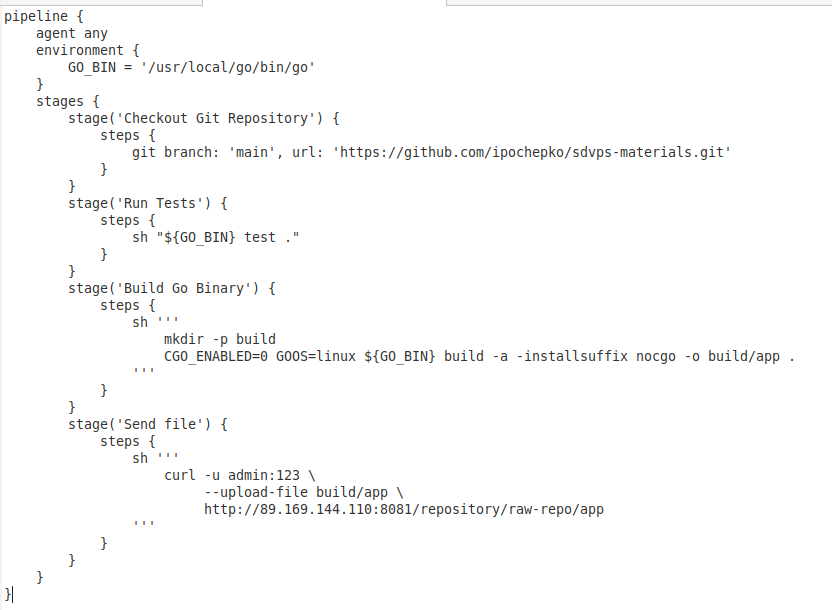
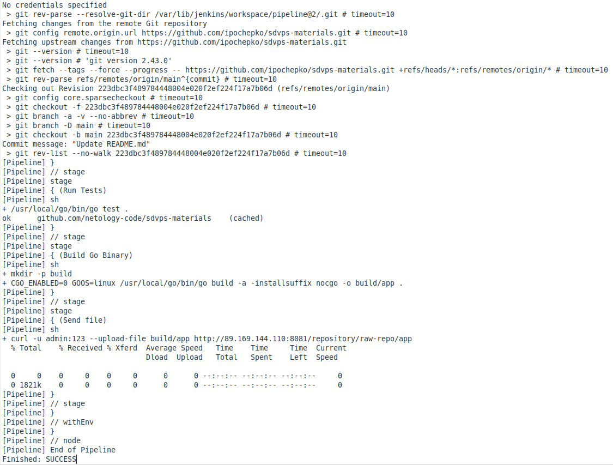

# Что такое DevOps. СI/СD Почепко Илья

Установите себе jenkins по инструкции из лекции или любым другим способом из официальной документации. Использовать Docker в этом задании нежелательно.
Установите на машину с jenkins golang.
Используя свой аккаунт на GitHub, сделайте себе форк репозитория. В этом же репозитории находится дополнительный материал для выполнения ДЗ.
Создайте в jenkins Freestyle Project, подключите получившийся репозиторий к нему и произведите запуск тестов и сборку проекта go test . и docker build ..
В качестве ответа пришлите скриншоты с настройками проекта и результатами выполнения сборки.

### Задание 2

**Что нужно сделать:**

1. Создайте новый проект pipeline.
2. Перепишите сборку из задания 1 на declarative в виде кода.

В качестве ответа пришлите скриншоты с настройками проекта и результатами выполнения сборки.

Задание 3
Что нужно сделать:

Установите на машину Nexus.
Создайте raw-hosted репозиторий.
Измените pipeline так, чтобы вместо Docker-образа собирался бинарный go-файл. Команду можно скопировать из Dockerfile.
Загрузите файл в репозиторий с помощью jenkins.
В качестве ответа пришлите скриншоты с настройками проекта и результатами выполнения сборки.

